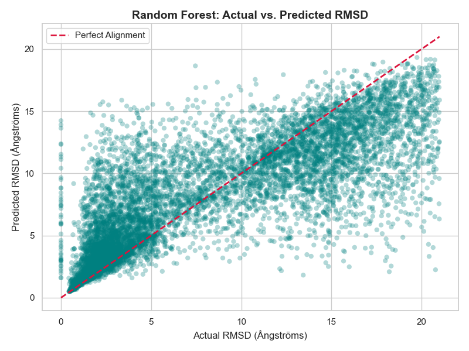
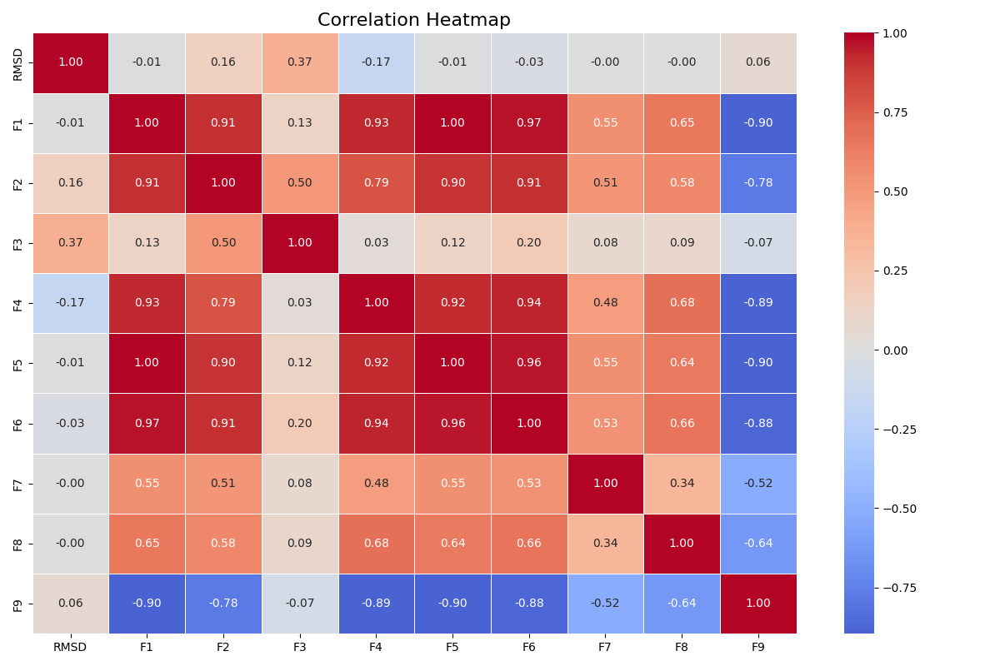
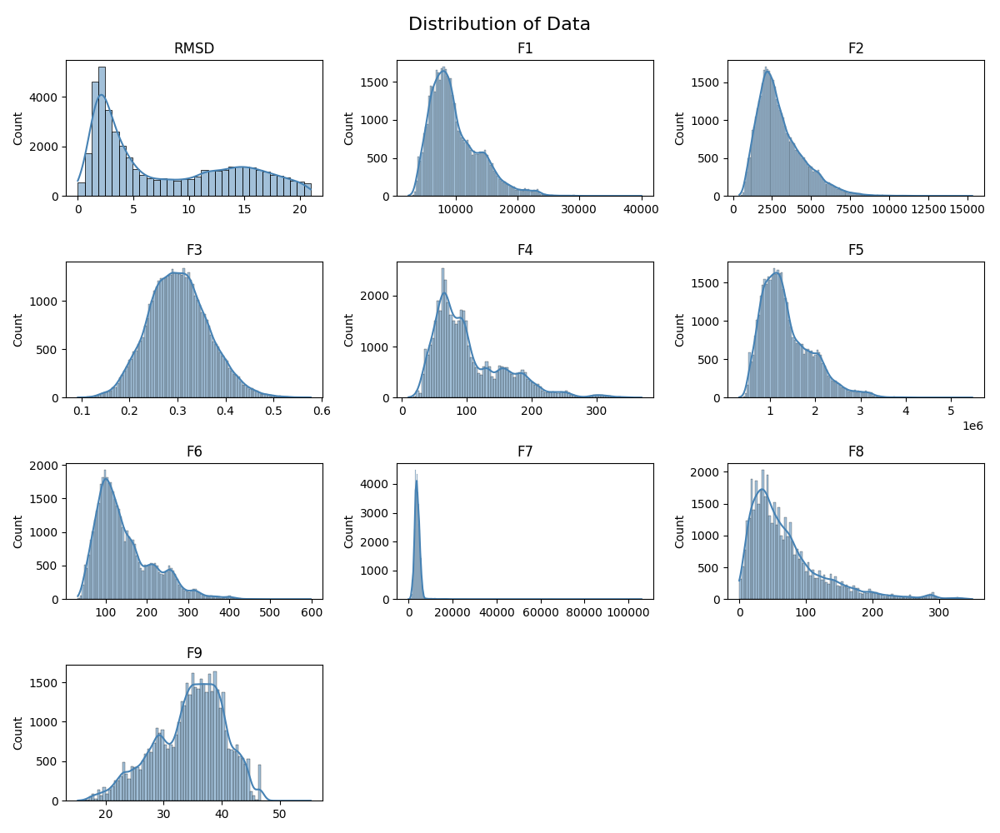
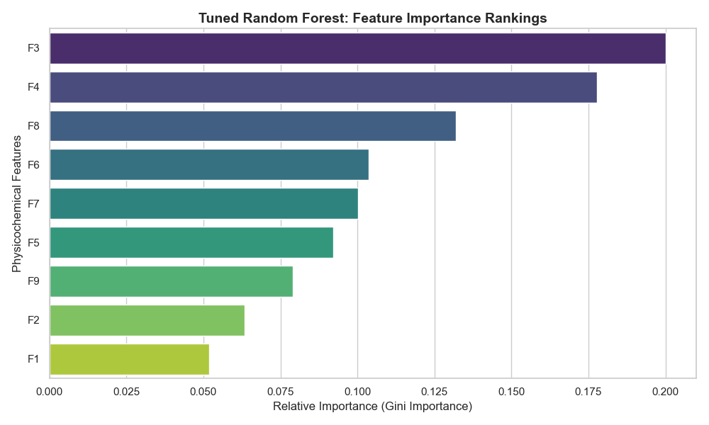

# Protein Tertiary Structure Prediction

## Overview
This project focuses on predicting the Root Mean Square Deviation (RMSD) of protein tertiary structures using physicochemical attributes derived from molecular dynamics simulations. In structural biology, RMSD measures how much a simulated protein conformation deviates from its ideal native folded state. 

Accurately predicting this deviation using machine learning bypasses computationally expensive, time-consuming biophysical simulations, allowing computational biology teams to filter out low-quality structural models instantly. 

This repository implements a full machine learning pipeline including exploratory data analysis, data cleaning, automated hyperparameter tuning via cross-validation, and model interpretability analysis using a dataset of ~45,000 protein samples from the UCI Machine Learning Repository.

## Project Structure
```
protein-tertiary-structure/
│
├── data/
|   └── CASP.csv
├── images/
|   ├── actual_vs_predicted_rmsd.png
│   ├── correlation_heatmap.png
│   ├── distribution_of_data.png
|   └── feature_importances.png
├── notebooks/
│   ├── model_training.ipynb
|   └── preprocessing.ipynb
├── requirements.txt
└── README.md
```

## Key Findings
* **Model Superiority:** The tree-based ensemble **Random Forest Regressor** radically outperformed linear benchmarks. The final optimized model achieved an **$R^2$ score of 0.6556**, an **RMSE of 3.6003 Å**, and an **MAE of 2.4744 Å**. By comparison, Ridge and Lasso regression collapsed, explaining only ~26% of data variance.
* **The Non-Linear Bottleneck:** Linear models failed due to extreme right-skewness, the physical presence of crucial structural outliers, and complex non-linear feature interactions. Regularization tuning via `RidgeCV` and `LassoCV` yielded near-identical results to baseline settings, visually proving that a straight linear regression line cannot capture the expanding variance inherent in unstable protein structures.
* **Granular Optimization:** Hyperparameter tuning via `RandomizedSearchCV` selected a deeper, fully unrestricted tree architecture (`max_depth: None`, `min_samples_leaf: 1`, `n_estimators: 200`). This confirms that maximum granularity is mathematically required to isolate rare but valid biological outlier signals and map complex physical folding thresholds.
* **Biological Drivers (F3 vs. F4):** Feature importance analysis revealed that hydrophobic core stability is the absolute dominant factor in predicting model quality. While closely related, the model separates the features based on distinct biological dimensions:
    * **F3 (Fractional area of exposed non-polar residue):** Measures the *macroscopic structural integrity* of the protein. High values reveal that entire hydrophobic amino acids—which should be tightly buried deep inside the protein core to avoid water—are instead sitting exposed on the outer surface. This is a severe macro-structural alarm indicating that the protein's overall globular shape has fundamentally unraveled or misfolded.
    * **F4 (Fractional area of exposed non-polar part of residue):** Captures *microscopic, local packaging defects*. Even if a hydrophobic residue is generally located in the interior, individual carbonaceous side-chains or atomic fragments can become exposed due to loose, suboptimal packing. High values indicate poor atomic structural fit and bad local geometric stabilization, allowing the model to accurately flag subtle decoy flaws even in partially folded states.

## Visualizations

### Actual vs. Predicted RMSD


### Correlation Heatmap


### Histograms


### Feature Importances


## How to Run
1. Clone the repository
2. Install dependencies: `pip install -r requirements.txt`
3. Launch Jupyter Notebook: `jupyter notebook`
4. Open `notebooks/preprocessing.ipynb` first, then `notebooks/model_training.ipynb`


## Tools Used
- Python 3
- Pandas
- NumPy
- Matplotlib
- Seaborn
- Scikit-learn


## Author

**Meschac Colongo**
M.Sc. Bioengineering Candidate — Cyprus International University
[GitHub: github.com/Mesolongo](https://github.com/Mesolongo)